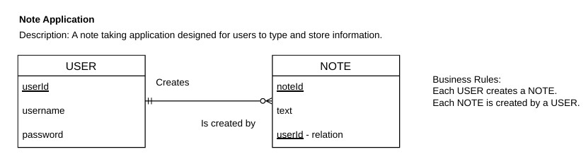
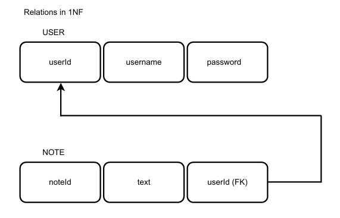

# Note Application

### Project Idea
Create a note taking application.

### Description
A note taking application designed for users to type and store information.

### Main Purpose
Create a full stack web application utilizing the html form element and a database with two entities.

### How to Use the Application
Make an account with a username and password.
Login with username and password.
Create a note. 
Type words, numbers, and special characters on the note.
Save the notes and changes made to them.
Logout of application using the navigation bar at the top of the screen.

### Key Features and Functions
Add and delete notes.

### Entity Relationship Diagram
A graphical representation of the database structure.

The User entity has a minimum and maximum cardinality of 1. The Note entity has a minimum cardinality of 0 and a maximum cardinality of many.

### Relation Diagram
A graphical representation of the relation between entities User and Note.

The diagram above illustrates the one-to-many relationship between entities User and Note in 3FN. The relation uses userId as the primary key in User and userId as the foreign key in Note.  